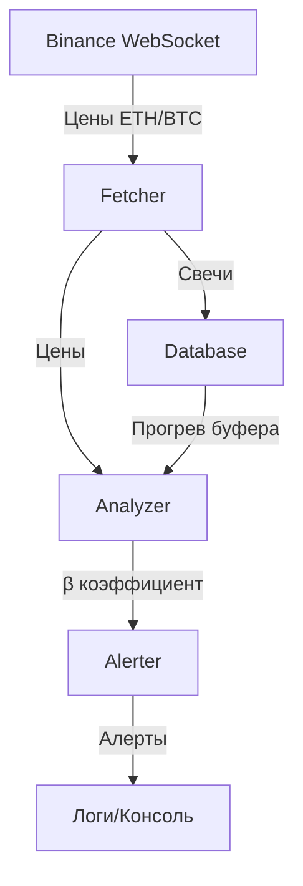

# 📊 MarketPulse — Анализ цен фьючерсов в реальном времени

**MarketPulse** — асинхронное Python-приложение для мониторинга и анализа цен фьючерсов ETH/BTC. Получает данные через WebSocket Binance, рассчитывает коэффициент β (бета) и отправляет алерты при значительных отклонениях.

---

## 🚀 Возможности

| Возможность | Описание |
|------------|----------|
|  **WebSocket Binance** | Получение цен ETHUSDT и BTCUSDT в реальном времени |
|  **Расчёт β (бета)** | Оценка волатильности ETH относительно BTC |
|  **Алерты** | Уведомления при изменении цены ETH более чем на порог (1% по умолчанию) |
|  **Хранение данных** | Сохранение свечей в PostgreSQL (или SQLite для тестов) |
|  **Авто-реконнект** | Автоматическое переподключение при обрыве WebSocket |
|  **Graceful shutdown** | Корректное завершение по Ctrl+C / SIGTERM |
|  **Docker** | Готов к запуску в контейнере |
|  **Тесты** | Покрытие ключевых модулей (pytest + asyncio) |

---

## 📋 Требования

- Python 3.10+
- PostgreSQL (или SQLite для разработки)
- Docker (опционально)

---

##  Установка

### 1. Клонирование репозитория

```bash
git clone https://github.com/your-username/marketpulse.git
cd marketpulse
```

### 2. Создание виртуального окружения

```bash
python -m venv .venv
source .venv/bin/activate  # Linux/Mac
# или
.venv\Scripts\activate     # Windows
```

### 3. Установка зависимостей

```bash
pip install -r requirements.txt
```

### 4. Настройка конфигурации

Скопируйте `.env.example` в `.env`:

```bash
cp .env.example .env
```

Отредактируйте `.env`:

```env
# База данных (PostgreSQL)
DB_USER=postgres
DB_PASS=postgres
DB_HOST=localhost
DB_PORT=5432
DB_NAME=marketpulse

# Параметры анализа
THRESHOLD=0.01           # Порог алерта (1%)
WINDOW_MINUTES=60        # Окно расчёта β
```

---

## 🎮 Запуск

### Локально

```bash
python main.py
```

### В Docker

```bash
docker-compose up --build
```

### Запуск тестов

```bash
pytest tests/ -v
```

---

## 📁 Структура проекта

```
marketpulse/
├── src/
│   ├── __init__.py
│   ├── config.py          # Конфигурация (Pydantic Settings)
│   ├── database.py        # Работа с БД (SQLAlchemy async)
│   ├── fetcher.py         # WebSocket клиент Binance
│   ├── analyzer.py        # Анализатор (расчёт β)
│   └── alerter.py         # Алерты (с защитой от спама)
├── tests/
│   ├── __init__.py
│   ├── test_config.py     # Тесты конфигурации
│   ├── test_database.py   # Тесты БД
│   ├── test_fetcher.py    # Тесты WebSocket
│   ├── test_analyzer.py   # Тесты анализатора
│   └── test_alerter.py    # Тесты алертера
├── data/                  # Данные (SQLite для разработки)
├── logs/                  # Логи
├── main.py                # Точка входа
├── Dockerfile
├── docker-compose.yml
├── requirements.txt
├── .env.example
├── .gitignore
└── README.md
```

---

##  Архитектура



### Поток данных:

1. **Fetcher** получает цены через WebSocket Binance
2. **Database** сохраняет каждую свечу
3. **Analyzer** накапливает свечи и рассчитывает β
4. **Alerter** проверяет изменение цены ETH и логирует алерт
5. При запуске **Analyzer** прогревается из БД (последние 60 свечей)

---

##  Расчёт β (бета)

Коэффициент β рассчитывается как отношение ковариации доходностей ETH и BTC к дисперсии доходности BTC:

```
β = Cov(R_eth, R_btc) / Var(R_btc)
```

Где:
- `R_eth` — доходность ETH за 1 минуту
- `R_btc` — доходность BTC за 1 минуту
- Окно расчёта — 60 минут

**Интерпретация:**
- `β > 1` — ETH волатильнее BTC
- `β = 1` — ETH движется синхронно с BTC
- `β < 1` — ETH менее волатилен, чем BTC
- `β < 0` — ETH движется против BTC

---

##  Алерты

Алерт срабатывает, когда **собственное движение ETH** (изменение цены, скорректированное на β) превышает порог (1% по умолчанию):

```log
[2024-01-15 14:30:00] ALERT: ETH own move +1.50% | ETH=2000.00 | BTC=30000.00
```

**Защита от спама:** алерты не чаще 1 раза в 5 минут.

---

##  Docker

### Сборка и запуск

```bash
docker-compose up --build
```

### Остановка

```bash
docker-compose down
```

### Просмотр логов

```bash
docker-compose logs -f
```

---

##  Тестирование

```bash
# Все тесты
pytest tests/ -v

# Конкретный модуль
pytest tests/test_analyzer.py -v

# С coverage
pytest tests/ --cov=src --cov-report=term-missing
```

---

## TODO / Планы

- [ ] Добавить Telegram-бота для алертов
- [ ] Реализовать HTTP API (FastAPI)
- [ ] Добавить поддержку нескольких пар
- [ ] Визуализация графиков (Streamlit)
- [ ] CI/CD (GitHub Actions)

---

##  Вклад в проект

1. Форкните репозиторий
2. Создайте ветку (`git checkout -b feature/amazing-feature`)
3. Закоммитьте изменения (`git commit -m 'Add amazing feature'`)
4. Запушьте (`git push origin feature/amazing-feature`)
5. Откройте Pull Request

---

##  Автор

**Roma M** — [@Romar-M](https://github.com/Romar-M)
